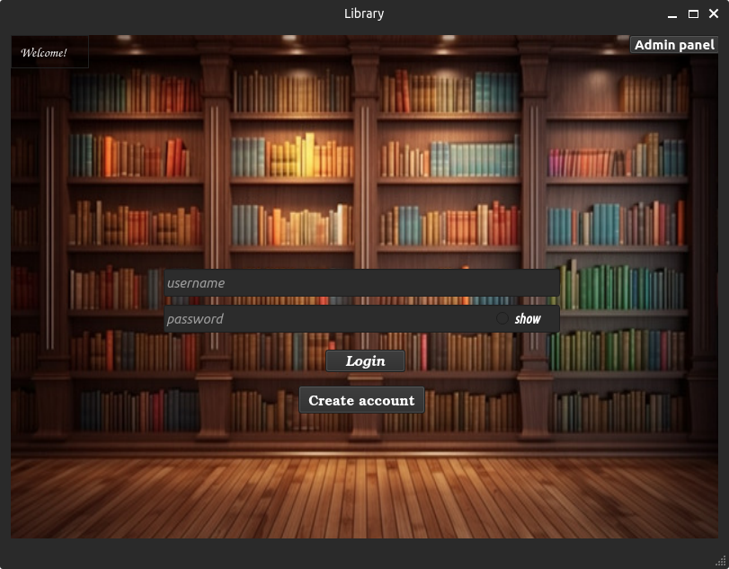
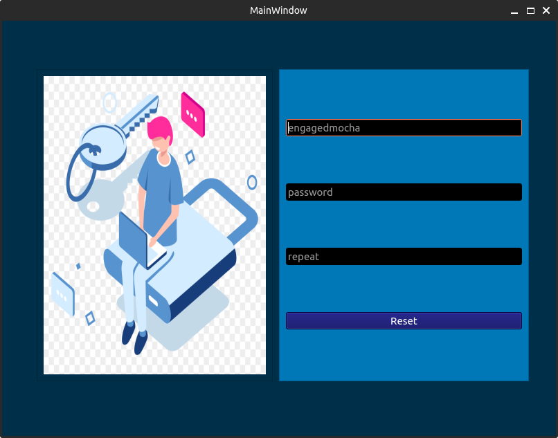
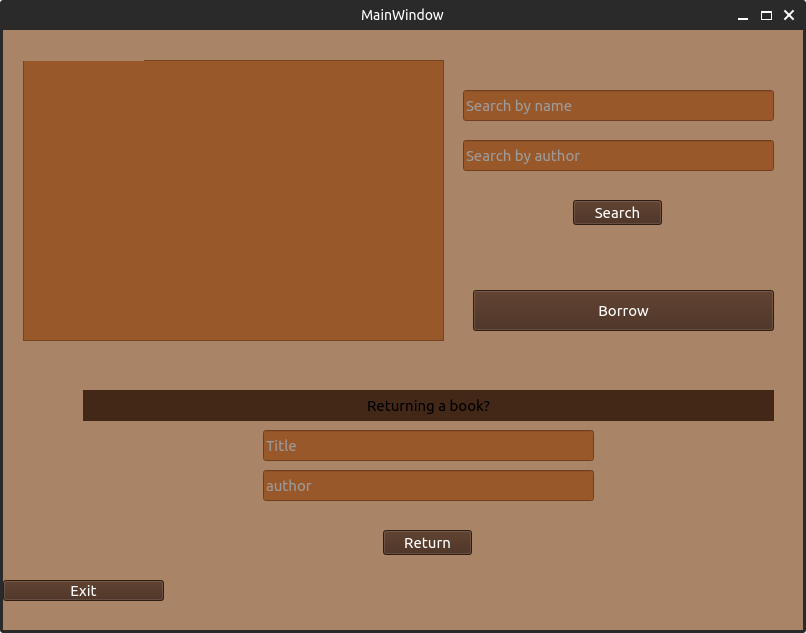
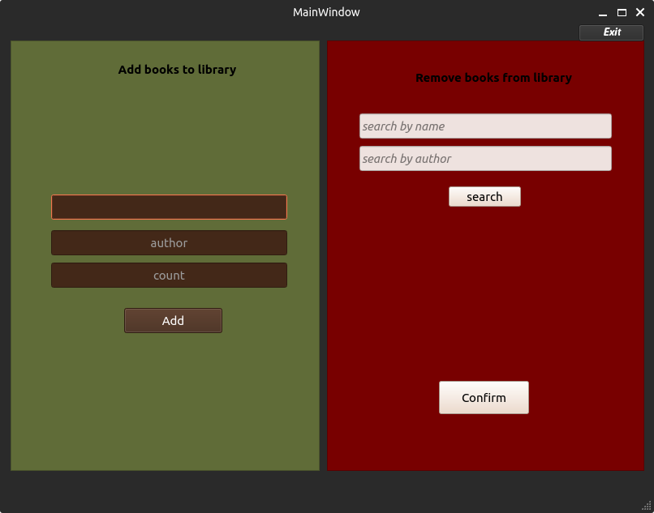

# C++ program using QT framework
 Program for managing and using a Library with close to real life functionality. the pages are as listed below:

* User login page
* Admin login page
* Create account page
* password reset page
* Admin panel
* User panel


> Note : Compiling this project would only be possible on linux machines( possibly debian based systems only ) because the build system was configured in a certain way.

You can follow the instructions on [**This document**](https://doc.qt.io/qt-5/linux-deployment.html) for application deployment<br>You can also check out [**This qt forum**](https://forum.qt.io/topic/116786/create-linux-executable-for-qt-application) for any question that might arise.


---

### Main login page

Users can type in their credentials and login using this page. "Forgot password" and "create account" can also be accessed using the corresponding bottons. A show password botton is placed for User's convenience.



On failed login attemps , a prompt will be shown to reset the password.


---

### Admin login page


This page also shares resemblence to the main login page except the back-end side of the program , only looks for admins in the database.

code snippet to pull admins from database:
```cpp
    QJsonArray admins = jsonObject["Admins"].toArray();
```
The search method searching for the admin's credentials:
```cpp
    for(QJsonValue value:admins){
        QJsonObject admin = value.toObject();
        if(admin["username"].toString() == current_username && admin["password"].toString() == current_password){
            Admin_panel *panel = new Admin_panel;
            panel->show();
            close();
        }
    }
```
---

### Create account page

Creates account with the given information.No two accounts with identical fullnames can be created.


After submit is clicked , new account will be added to the database for later logins.

In detail , a new jsonobject is created with the new account's info and appended to the previous list of accounts.
```cpp
    QJsonObject newacc;
    newacc.insert("username",user);
    newacc.insert("password",pass);
    newacc.insert("name",name);
    newacc.insert("borrowed","0");
```
```cpp
    jsonObject["Members"] = users;

    changeType.setObject(jsonObject);

    jsonFile.open(QIODevice::WriteOnly);
    jsonFile.write(changeType.toJson());
```

---

### password reset page



The user that tried to login but failed will be passed to this page for User's convenience and displayed as placeholder for the username.

After "Reset" is clicked , database is queried for the requested username and if it was found , the new username will replace the old one . (currently no security measures for this part.I plan on adding an email verfication for security purposes)

function responsible for setting the new password : 
```cpp
    setnewpass(QJsonObject ResetACC,QString newpass)
```

Loop that finds the account : 

```cpp
    int counter = 0;
    for(QJsonValue value:users){
        QJsonObject account = value.toObject();
        if(account["username"].toString()==ResetACC["username"].toString()){
            account["password"] = newpass;
            users[counter] = account;
            break;
        }
        counter++;
    }
```

---

### User panel

This page is available for every member of this library . they can borrow books using this app



Search by name and/or author is available.Returning a book requires full info on that book because the info will be used to search the database.

    Note:Upon exiting this page , the "Exit" button must be pressed otherwise the changes will not be saved to the databse. This button will call the destructor of the page which is responsible for saving the changes to the database.
Destructor of the page : 

```cpp
        User_panel::~User_panel()
    {
        this->jsonObject["Members"] = this->users;
        this->jsonObject["books"] = this->books;
        this->changeType.setObject(this->jsonObject);

        QFile File(this->jsonPath);
        File.open(QIODevice::WriteOnly);
        File.write(this->changeType.toJson());
        File.close();

        delete ui;
    }
```

saving to the database will be done once , and upon the exit for more efficiency.

---

### Admin panel

This page is used by the admins to remove/add books from(to) the database.



code snippet for adding a book : 

```cpp
    QJsonObject newbook;
    newbook.insert("title",titleN);
    newbook.insert("author",authN);
    newbook.insert("available",amount);

    this->books.append(newbook);
```

Removing books from the library can be done one by one

```cpp
    int counter =0;
    for(QJsonValue value:books){
        QJsonObject rm = value.toObject();
        if(rm == this->book){
            rm["available"] = QString::number(rm["available"].toString().toInt()-1);
            books[counter] = rm;
            break;
        }
        counter++;
    }
```


